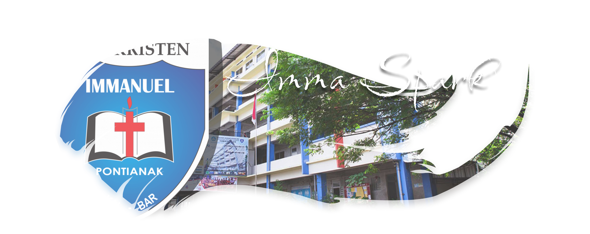

<h1 align="center">Logimm</h1>

<!--  -->
 

   
   <!--  --> 
   
   
   <!--  -->

## Table of Contents

   
Tekan untuk Buka

<!-- - [Instalasi](#instalasi)
- [Penggunaan](#penggunaan) -->
- [Arsitektur](#arsitektur)
- [Kontributor](#kontributor)
- [Lisensi](#lisensi)
- [Changelog](#changelog)
- [Link](#link)

<!-- ## Instalasi

   
Instalasi

### Step 1

   
Pilih Versi
 

   

      
Unstable Version

1. Download repository ini (Cari tombol code warna hijau di bagian atas terus tekan "Download ZIP").
      

         
Step 1A-1

         
      

2. Ekstrak file tersebut.
      

         
Step 1A-2

         
      

3. Pindahkan folder yang telah diekstrak ke directory "C:\laragon\www\". Folder yang dipindahkan seharusnya dapat langsung melihat isi dari websitenya, apabila dalam folder yang dipindahkan terdapat sebuah folder lagi, keluarkan semua isi dari websitenya keluar dari foldernya.
      

         
Step 1A-3

         
      

4. Buka Laragon.
      

         
Step 1A-4

         
      

5. Tekan "Start All" dan tekan "Database".
      

         
Step 1A-5

         
      

6. Login ke phpMyAdmin menggunakan username "root" dan password kosong.
      

         
Step 1A-6

         
      

7. Buat database dengan nama "immaspark".
      

         
Step 1A-7

         
      

8. Import file "immaspark.sql" yang terdapat di dalam folder yang telah dipindahkan.
      

         
Step 1A-8

         
      

9. Lanjut ke Step 2.
   

 
   

      
Stable Version

1. Buka page <a href="https://github.com/Banditov/XI-TKJ-3_PWL_Kelompok-8/releases">Releases</a> dari repository ini.
      

         
Step 1B-1

         
      

2. Pilih salah satu release, tekan "Assets", dan tekan "Source code (zip)".
      

         
Step 1B-2

         
      

3. Ekstrak file tersebut.
      

         
Step 1B-3

         
      

4. Pindahkan folder yang telah diekstrak ke directory "C:\laragon\www\". Folder yang dipindahkan seharusnya dapat langsung melihat isi dari websitenya, apabila dalam folder yang dipindahkan terdapat sebuah folder lagi, keluarkan semua isi dari websitenya keluar dari foldernya.
      

         
Step 1B-4

         
      

5. Buka Laragon.
      

         
Step 1B-5

         
      

6. Tekan "Start All" dan tekan "Database".
      

         
Step 1B-6

         
      

7. Login ke phpMyAdmin menggunakan username "root" dan password kosong.
      

         
Step 1B-7

         
      

8. Buat database dengan nama "immaspark".
      

         
Step 1B-8

         
      

9. Import file "immaspark.sql" yang terdapat di dalam folder yang telah dipindahkan.
      

         
Step 1B-9

         
      

10. Lanjut ke Step 2.
   

### Step 2

   
Step 2

1. Buka terminal di Laragon.
      

         
Step 2-1

         
      

2. Ketikkan "cd (Nama folder yang diekstrak tadi)". Apabila lupa, ketikkan "ls" dan cari nama folder yang sesuai.
      

         
Step 2-2

         
      

3. Ketikkan "php -S localhost:5500 -t public" dan tekan link yang diberikan sambil menekan ctrl kiri.
      

         
Step 2-3

         
      

   <h3 align="center">Selesai!</h3>

 

   
Hosted

<a href="http://immaspark.page.gd">Tekan aku!</a> 

 -->

<!-- ## Penggunaan
ImmaSpark adalah sebuah website tempat siswa bisa menyimpan, membagikan, dan mengembangkan ide-ide kreatif mereka supaya tidak mudah lupa atau hilang begitu saja. Di website ini, siswa dapat membuat postingan ide, berdiskusi lewat komentar, serta memberi vote pada ide siswa lain. Jumlah vote yang didapat akan menunjukkan perkembangan dan ketertarikan pengguna terhadap ide tersebut, sehingga ide-ide yang menarik bisa lebih mudah berkembang dan dikenal banyak orang. Dengan adanya ImmaSpark, siswa memiliki wadah untuk lebih bebas berkreasi, berbagi pendapat, dan saling mendukung dalam mengembangkan ide baru. -->

## Arsitektur

<b>-- Front-end Library --</b>  

![Anime.js](https://img.shields.io/badge/Anime.js-FF2D55?style=flat&logo=data:image/png;base64,iVBORw0KGgoAAAANSUhEUgAAABQAAAAUCAYAAACNiR0NAAAAAXNSR0IArs4c6QAAAARnQU1BAACxjwv8YQUAAAAJcEhZcwAADsEAAA7BAbiRa+0AAAAZdEVYdFNvZnR3YXJlAFBhaW50Lk5FVCA1LjEuMTGKCBbOAAAAuGVYSWZJSSoACAAAAAUAGgEFAAEAAABKAAAAGwEFAAEAAABSAAAAKAEDAAEAAAACAAAAMQECABEAAABaAAAAaYcEAAEAAABsAAAAAAAAANl2AQDoAwAA2XYBAOgDAABQYWludC5ORVQgNS4xLjExAAADAACQBwAEAAAAMDIzMAGgAwABAAAAAQAAAAWgBAABAAAAlgAAAAAAAAACAAEAAgAEAAAAUjk4AAIABwAEAAAAMDEwMAAAAABZKX6wz+x41AAAAbxJREFUOE/FlE9IlFEUxc8LZ6E0IQqlm9lIm4jcCIEYrQIV/APujIh2YTujXUuFwEGwXLUJ0a2OC1v5B9GxghEkgqJW4oCSiIsBUZrg5+Z+w3tvJkgwOvAt7rnnnvfu++570v8AkAbSMV8LLiYSAO2SHku6J+mG0T8lbUqacc59jkpqA0gBWaDMn1E2TV1cH8DMFuPqWvh4BF2rrF+bZ6o5R3/iEbQMZCU9t/BE0rakXUklSb9N3yDp9sNP6lzar5S+KA25bCWSnZnX5g/gViDwADwY3YG7y9C5CvfXGIw1Aia9jkY8fgB4B8wBb4AM0AL0AiumnwjMPuQ3HFDwDL8Bs8Ar4L3lvlruqbfYtHGFwNDmbM8zfAlcB1KRLgO0efGC6feSOb3iFxgKzrkx59yhpAbgGTAOjEvqllSUpOPjkpOUiYslSVubQctvEx545O0a4BRotVwjsG982LIJkp/y2uOagCHgCTAM3PFyN4Ezq5msGHmCdksWgQ4gOA7gKtAH1FvcY/qyXdNq2HUC+AV8AdaBNSAPHNiOvtt3YNpwoH3Y1cuZ8G+QiyehChd8HKrM/v3zVQsXeWAvHedBNW9Pb9ocIgAAAABJRU5ErkJggg==)

<b>-- Bridge Library --</b>  

<b>-- Back-end Framework --</b>  

<b>-- UI/UX Design --</b>  

<!-- <b>-- Hosting --</b>   -->

## Kontributor

 [Christopher V. C. - "Banditov"](https://github.com/Banditov), sebagai ketua & full-stack developer. 
 [Michelle N. - "MN ( o v o )"](https://github.com/idunno2467), sebagai UI/UX designer. 
 [Valentino - "Naomikoshi"](https://github.com/Naomikoshi), sebagai front-end developer.

## Lisensi

Didistribusikan di bawah Lisensi MIT. Lihat [`LICENSE.txt`](./LICENSE.txt) untuk informasi lebih lanjut.

## Changelog

   
Tekan untuk Buka

   
Agustus

### 29/08/2026 - 0.2.0

- Menyelesaikan halaman login
- Membuat helper ikon
- Membuat README baru

### 27/08/2026 - 0.1.0

- Membuat halaman login

### 26/08/2026 - 0.0.0

- Menambahkan lisensi MIT

### 22/08/2026 - 0.0.0 ( First Commit )

- First Commit

## Link

- [Figma](https://www.figma.com/design/sRRJEFI7uuZzOvflsmt41e/Logimm?node-id=0-1&t=52io9Yi9WMViL7xb-1)
